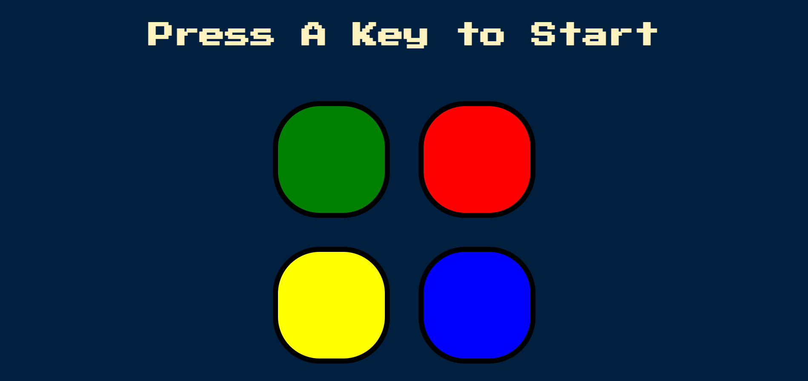

# Simon Game
Simon game tests your memorizing power. In this game, you need to remember a path and on every new level, you need to start travel from the beginning in the correct sequence, or else the game will be over.  <a href="https://play-simongame.netlify.app/"> Play Now. </a>

**How to play?**

Press the 'A' key on your keyboard to start the game. Then you will see one of the boxes to be blink with a sound. Now you need to remember the sequence of blinking of the boxes and tap the boxes in the order, on every new level, one more object will be added to the sequence and you need to start tapping the boxes in the order from the beginning, one wrong move and the game will be over.

 
Check more of my amazing articles on medium: <a href="https://medium.com/@priyank-kumar-singh"> medium.com/@priyank-kumar-singh</a>  
For more amazing stuff do checkout my <a href="https://www.youtube.com/channel/UCNdptkGGmUsmjuIL8sQ5NpA">youtube channel.</a>
